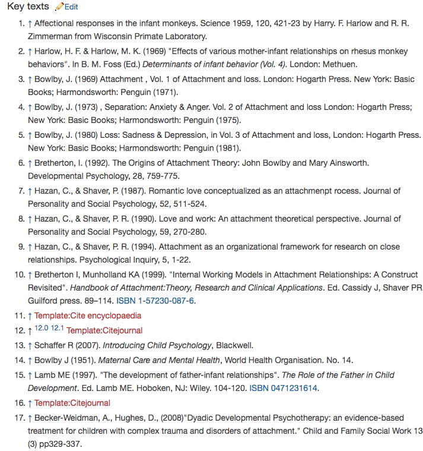

# 搜索
W 开头的作业，我以前会。就换了一个手头正在做的搜索作业，应用了搜索技能、验证等技巧。

## 背景
>1800503 准备「依恋理论」文章撰写
>需要查询 依恋理论的素材

>目的：查询 类似 wiki 的心理学百科网站

## 分析过程

>1. wikipedia 查询依恋理论，看是否属于专业词汇

### 1 先确定依恋理论的英文
——欧陆词典查「依恋理论」的中文，双语例句中在「心理学」范围内验证英文说法；

初步确定「attachment thoery」
### 2 权威验证：
#### 2.1 wikipedia 查询「attachment thoery」

 得到 [attachment theory - Search results - Wikipedia](https://en.wikipedia.org/w/index.php?title=Special:Search&search=attachment+theory&fulltext=1&profile=default&searchToken=2426qvslqkz0tg88172rxvqyz)
  
     
>**结果**

- 有attachment thoery；说明这个英文词比较准确；

#### 2.2 其他wiki 网站验证
如果不放心，可以多查证，比如通过`相似网站`求证：
#### 2.2.1如何找 wikipedia 相似网站，还是心理学方面

应用工具：[Similar Sites - 发现相关的网站 - Chrome 网上应用店](https://chrome.google.com/webstore/detail/similar-sites-discover-re/necpbmbhhdiplmfhmjicabdeighkndkn)
   
   用 `similar sites` 查询后，发现-->

除了 wikipedia , 还可以 查询 「site topics」类的网站如

`encyclopedia、wiki、dictionary`

前面加 `psychology` 限定即可

一一试探,得到结果

> 1. 输入 psychology wiki
得到两个有用网站：

> [Psychology Wiki | FANDOM powered by Wikia](http://psychology.wikia.com/wiki/Psychology_Wiki)` 

>[Main Page - PsychWiki - A Collaborative Psychology Wiki](http://www.psychwiki.com/wiki/Main_Page)`

> **2**. 输入关键词 psychology wikipedia 

同样得到 [Psychology Wiki | FANDOM powered by Wikia](http://psychology.wikia.com/wiki/Psychology_Wiki)  ；说明这个网站比较大众

>**3** 输入关键词：psychology dictionary

发现：输入 attachment 得到的结果太多；思考字典词典类毕竟和 wiki 词条不是一个类别；干扰信息多；

>**4**. 同事教授技巧，直接用网站：[Attachment theory - Wikiwand](https://www.wikiwand.com/en/Attachment_theory) 
>特点：更好的阅读体验；内容集成；来源于 wikipedia 

**结果**
说明关键词 「psychology wiki」「psychology wikipedia 」得到的结果比 dictionary 更有效；尤其以「wikipedia」为优；

#### 2.2.2 四个网站哪个网站比较好

得到四个wiki 网站

- 众所周知的 wikipedia
-  [Main Page - PsychWiki - A Collaborative Psychology Wiki](http://www.psychwiki.com/wiki/Main_Page) 
- 通过查询心理学维基类找到：[Psychology Wiki | FANDOM powered by Wikia](http://psychology.wikia.com/wiki/Psychology_Wiki) 
- 通过同事介绍得到： [Attachment theory - Wikiwand](https://www.wikiwand.com/en/Attachment_theory) 

分别用 `attachment thoery` 做搜索关键词，去试验这  个网站的搜寻结果，看各自网站的特点：

-  [Main Page - PsychWiki - A Collaborative Psychology Wiki](http://www.psychwiki.com/wiki/Main_Page) 无结果;
-  [Psychology Wiki | FANDOM powered by Wikia](http://psychology.wikia.com/wiki/Psychology_Wiki) 结果很多，而且分别在 `article/photos/blogs/people/everything` 这 5 个维度给出了搜索结果，进去查看，发现不仅有文章概述，还有相关视频、重要人物；非常全面；但是否专业，还要待下一步具体文章检验；

   

- Wikipedia 
前言是总述，content 有目录；相当于小的综述

末尾还有相关领域概览、赞成点、争论点；信息更全

- wikiwand:[Attachment theory - Wikiwand](https://www.wikiwand.com/en/Attachment_theory) 

信息进行分类；给出了链接；
参考资料少，给出学科关键贡献人物

#### 结论
比较上面四个wiki 类网站，发现

Wikipedia 胜在全面；wikiwand 胜在看起来优雅舒服，内容其实与wikipedia 一致； Psychology Wiki | FANDOM 胜在 `article/photos/blogs/people/everything` 这 5 个维度给出了搜索结果；

这三个网站都可以作为验证渠道。

上面的方法应用了 大脑爱比较、交叉验证；

#### tip
搜索时的意外所得

1. 注意：Bibliography 和 book 有区别。什么区别呢？
bibliography 是某个reading对自己的影响 哪怕你paper里面没写
reference 是具体在paper里面 你引用了哪些

2. 下载pdf细读-->
目的一是细读；wikipedia 最好通过 crtl+p  打印；因为可以显示「contents」的目录；但如果想去掉网页的其他东西，比如图片广告，可以选 「[Print Friendly & PDF - Chrome 网上应用店](https://chrome.google.com/webstore/detail/print-friendly-pdf/ohlencieiipommannpdfcmfdpjjmeolj)

 

3. 顺藤摸瓜发现还有相关的：取跟自己相关的，如 attachment parenting/in children/measures/theory

4. 最好能找一篇综述，找找类似关键词`Literature Review；research summary；Overview`

## changelog

- 180504 

