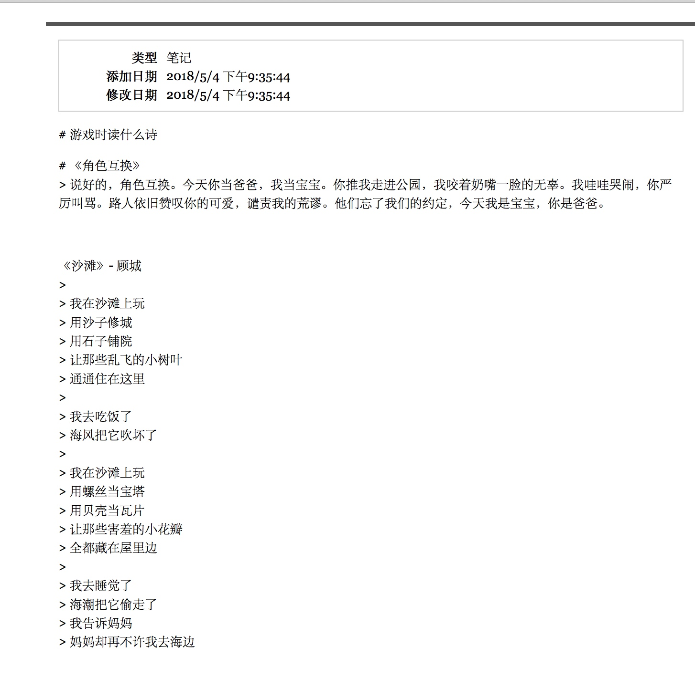

# note

要搜索单条笔记的内容,可以通过以下方法间接实现:使用笔记的右键菜单,选择“从选中的条目生成报告…”.生成的笔记报告将在Firefox当前的标签页中打开,这时您可以使用Firefox的文本搜索工具进行搜索.

要改变条目的排序方式,点击中栏顶部标题栏中的任意一项.如点击”标题”,所有的条目将根据条目的标题进行排序.再次点击标题栏上的同一项目,可以在”升序”与”降序”之间进行切换(标题栏上分别以向上的箭头和向下箭头表示).

按有标签的排序，没标签的删掉。

occur a error  

the translator will update automatically, or you can update your translator now. Please let us know if you encounter any further errors.

参考：
the translator will update automatically, or you can update your translator now. Please let us know if you encounter any further errors.

把黄忠的换过去

